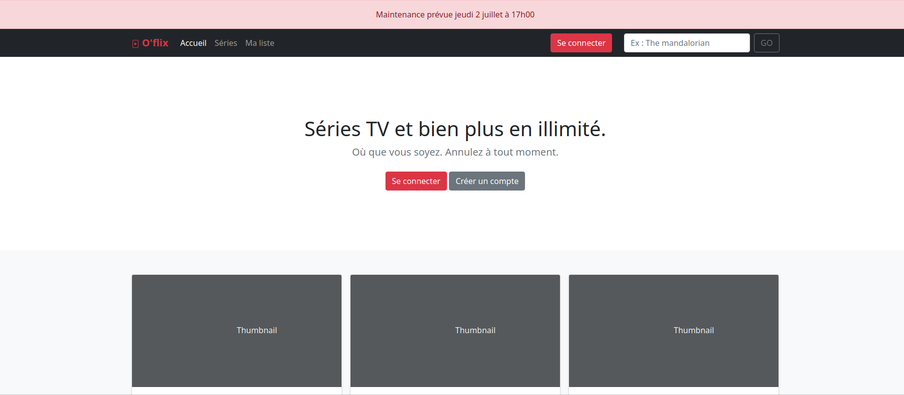

## Symfony - Oflix



# Création d'une interface utilisateur :

- D'afficher une liste d'éléments d'une entité
- D'afficher les détails d'une entité

D'après le MCD suivant :

```
TVSHOW : title, synopsis, image, nbLikes, created at, published at

SEASON : season number, created at,  published at
HAS, 0N TVSHOW, 11 SEASON

EPISODE : episode number, title, created at,  published at
CONTAINS, 0N SEASON , 11 EPISODE
```

# Réalisation d'un backoffice :

- Lister (`list`)
- Ajouter (`add`)
- Afficher (`show`)
- Modifier (`edit`)
- Ou supprimer (`delete`) des entités (Série, Catégorie, ...).  

D'après le MCD suivant :

```
TVSHOW : title, synopsis, image, nbLikes, published at

SEASON : season number, published at
HAS, 0N TVSHOW, 11 SEASON

EPISODE : episode number, title
CONTAINS, 0N SEASON , 11 EPISODE


CHARACTER : firstname, lastname, gender, bio, age
PLAY, 0N TVSHOW, 1N CHARACTER

CATEGORY : name
LINKED, 0N TVSHOW, 0N CATEGORY
```